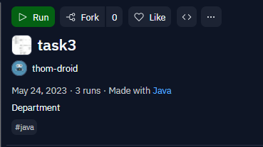
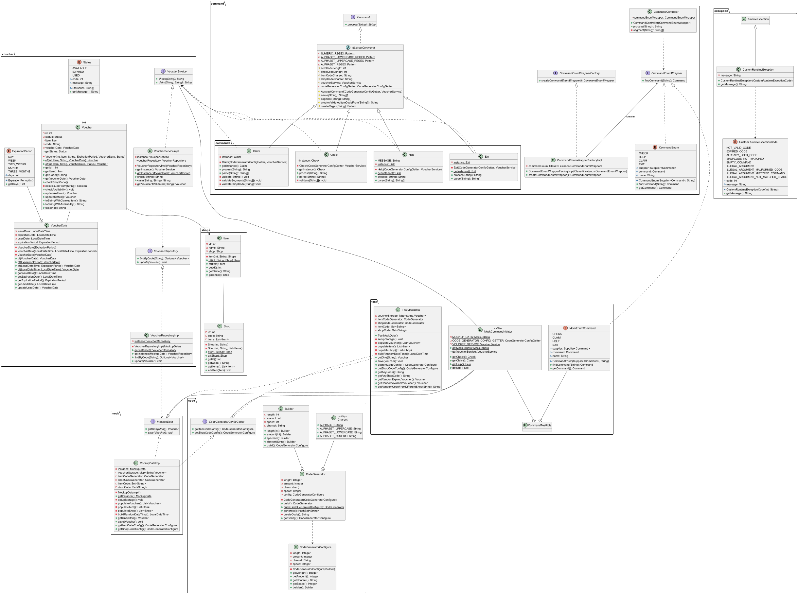
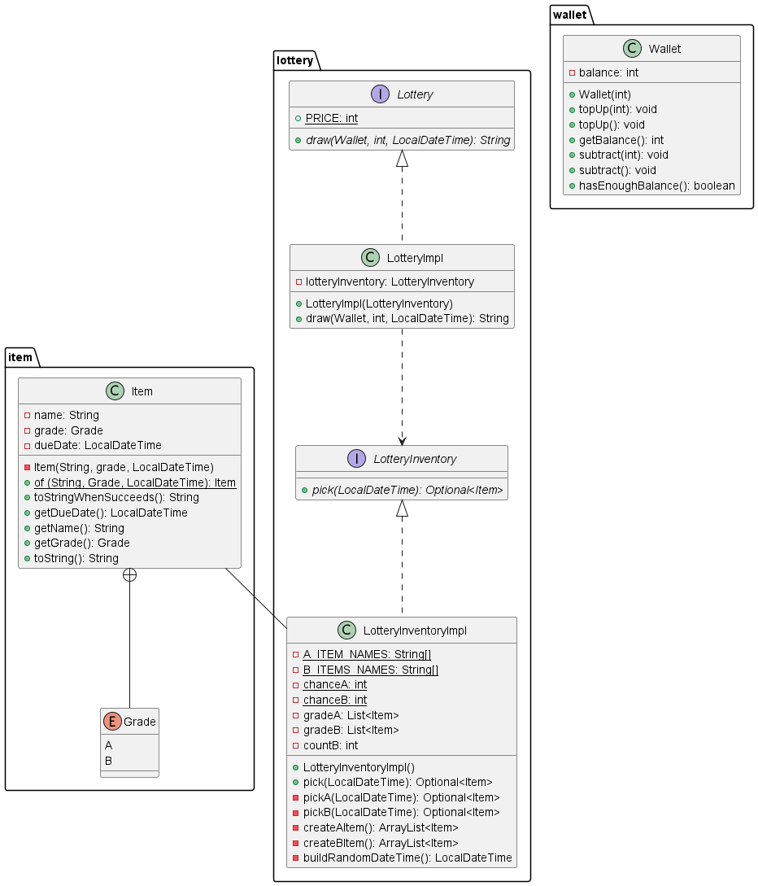
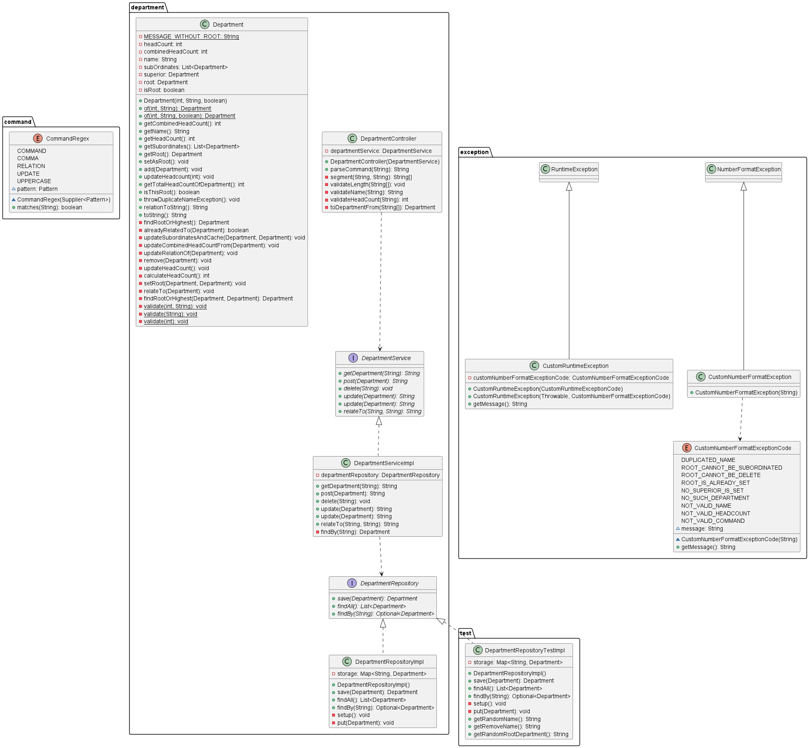
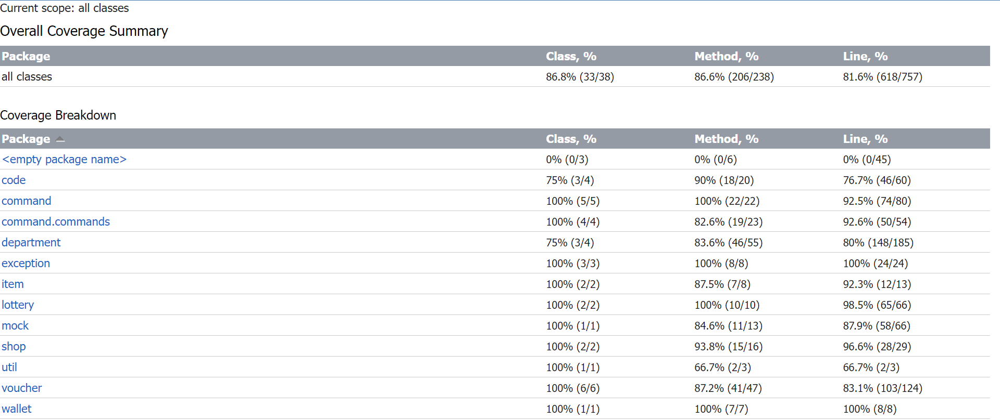

# 개요

## 사용 언어 및 의존성
프로그램 요구 사항을 보았을 때 사용자가 입력한 문자열과 콘솔의 출력으로 소통하게 되므로
다른 프레임워크는 사용하지 않고, Java와 JUnit만을 사용하여 코드를 작성했습니다.
 
Java 11버전은 JVM GC 성능 개선 및 JFR 프로파일링 기능이 추가되었습니다. 
이 프로그램을 작성하면서 특별히 사용한 기능은 없습니다만, 8버전에 대한 지원이 끝나고, LTS JDK 중 가장 널리 사용되고 있기 때문에 채택하였습니다.

JUnit 5은 Java의 람다식과 병행하여 다양한 상황을 쉽게 테스트할 수 있게 해줍니다. 특히 예외 상황을 `assertThrows()`을 사용하여
`Throwable` 로 받아 그 메시지를 비교하는 형태로 테스트를 하는 데 유용하기에 사용하였습니다.

여기서는 애플리케이션 전반에 대해 설명하였습니다. 자세한 코드의 설명은 각 클래스 api에 기술해놓았습니다.

## 빌드 및 배포 
프로그램을 쉽게 사용할 수 있도록 Maven으로 빌드하여 jar 파일을 웹에서 코드를 실행할 수 있는 replit 이라는 서비스에 업로드하였습니다.

아래 링크로 이동하여 우측 상단의 run 버튼을 누르시면 프로그램이 실행됩니다.



- task1: [상품 교환 프로그램](https://replit.com/@thom-droid/task1?v=1)
- task2: [경품 추첨 프로그램](https://replit.com/@thom-droid/task2?v=1)
- task3: [부서 인원 조회 프로그램](https://replit.com/@thom-droid/task3?v=1)


## Task1 - 상품 교환 프로그램

### 핵심 패키지 

#### command

경품 확인, 경품 수령, 도움말 출력과 같이 커맨드 입력이 중요하다고 판단하여 
커맨드를 인터페이스로 추상화하였습니다. 이 인터페이스는 `process(String)` 추상메서드를 가지고 있으며,
`Check`, `Claim`, `Help`와 같은 각 구현 커맨드 구현체가 이를 재정의하도록 하였습니다. 
이렇게 하면 추후에 다른 커맨드가 쉽게 추가될 수 있습니다.

각 구현체는 `CommandEnum` 열거 타입의 원소에 참조를 전달하여 상수처럼 사용할 수 있게 했습니다.
사용자가 입력한 문자열을 `CommandController`에서 유효성을 검증한 뒤, 커맨드에 해당하는 부분만 분리하여 해당되는 열거타입을 찾고, 
그 열거 타입이 참조하는 커맨드 구현체의 `process(String)` 를 호출하도록 하였습니다.

```java
public enum CommandEnum implements CommandEnumWrapper {
    CHECK(Check::getInstance),
    CLAIM(Claim::getInstance),
    HELP(Help::getInstance),
    EXIT(Exit::getInstance)
}
```

### 코드 흐름

1. `CommandController` 에서 입력된 문자열 검증
2. 문자열 중 명령어를 확인하여 해당하는 `CommandEnum` 탐색
3. `CommandEnum`에 매핑된 `Command` 구현체의 `Command.process()` 실행
4. `VoucherService`, `VoucherRepository` 통해 비즈니스 로직 수행 및 결과 리턴


### UML



### 비즈니스 요구사항 체크

1. 고객이 상품 교환을 요구하면 가능한지 여부와 교환 결과를 안내해 주세요.
- `Claim` 구현체가 이를 담당하며, 교환 성공 여부와 교환일자를 포함한 정보를 리턴합니다.
2. 상품 코드는 10개가 준비되면 고객에게 10개까지만 제공됩니다.
- 프로그램 실행 시 준비됩니다.
3. 상품 코드는 0~9 자연수 글자로 이루어져 있으며 9문자로 이루어져 있습니다.
- 자연수 9문자가 기본으로 구성되어 있으며, `CodeGeneratorConfigure`로 변경할 수도 있습니다.
4. 상품 코드를 이용하여 상품 교환이 1번 이루어지면, 다시 해당 상품 코드로는 상품 교환을 할 수 없습니다.
- `Claim` 구현체를 통해 상품 교환이 이루어지면 `Voucher.Status`가 `USED`로 바뀌며, `USED`인 `Voucher`는 교환이 불가합니다.
5. 고객은 상품 코드를 사용하기 전에 미리 상품을 교환할 수 있는지 확인이 가능합니다.
- `Check` 구현체가 이를 담당합니다.
6. SHARETREATS는 고객에게 CHECK, HELP, CLAIM 명령어를 사용할 수 있게 합니다.
   각 키워드는 CHECK(상품 교환여부 확인), HELP(사용법 안내), CLAIM(상품 교환) 을 의미합니다.
- 각 명령어는 `Command`를 구현하는 구현체 `Check`, `Help`, `Claim` 로 구현됩니다.
7. SHARETREATS 는 상품 코드 목록을 준비하고 고객은 상품 코드내에서만 상품 교환이 가능합니다.
- 없는 코드를 입력하거나 설정하지 않은 문자열로 입력한 경우 예외를 던집니다.
8. 상품 교환을 할 때는 어떤 상점에서 교환하였는지 상점 코드를 알아야 합니다.
  - `Claim` 명령어가 실핼될 때 상점코드에 대한 유효성 검사도 실시합니다.
9. 상점 코드는 A~Z,a~z 까지의 대,소 영문자만 사용이 가능하며 6문자로 이루어져 있습니다. |
   | [ 고객의 입력 ] | 1. 문자열은 0~9, a~z, A~Z, SPACE 까지의 문자를 무작위로 입력할 수 있습니다.
- 상점코드는 대소문자 알파벳 6문자로 기본 설정되어 있으며, `CodeGeneratorConfigure`로 변경이 가능합니다.
- white space는 검증할 때 `String.trim()`으로 제거됩니다.


## Task2 - 경품 추첨 프로그램

### 핵심 패키지

#### lottery

경품 추첨을 담당하는 인터페이스 `Lottery` 입니다. `Lottery`는 `draw(Wallet, int, LocalDateTime)` 
메서드를 가지고 있습니다. 파라미터로 `Wallet`, 
추첨 횟수, 추첨을 시도하는 현재 시간을 받으며, 추첨 횟수만큼 추첨을 시도합니다.
지갑의 잔액이 없으면 추첨을 종료하며, 10,000원을 자동 충전합니다.

A 경품은 90%, B 경품은 10% 의 추첨 확률을 가지고 있습니다. `Optional<Item>`을 사용하여
`Optional.isEmpty()`가 `true`이면 실패이므로 B 경품 추첨을 시도합니다. 여기서도 추첨을
실패하면 값이 없는 `Optional`이 리턴됩니다.

추첨 확률은 `java.util.Random` 을 통해 구현하였습니다. 1에서 100까지의 숫자를 무작위로 뽑고, 1이상 90이하일 때 A 추첨을 시도하는 방식입니다.


### 코드흐름

1. 추첨 횟수를 입력
2. 지갑의 잔액을 확인하여 추첨 시도
3. A 성공 시 유효기간이 지나지 않은 상품 리턴, 실패 시 B 시도
4. B 성공 시 유효기간이 지나지 않은 상품 리턴, 실패 시 꽝 리턴
5. 잔액 없을 시 자동 충전


### UML




### 비즈니스 요구사항 체크

1. 돈은 자연수로 정의되며 100 이라는 숫자는 여기서 100원을 의미합니다.
- `Lottery` 멤버 필드로, int 타입의 상수로 설정 되어있습니다. 
2. 뽑기 1회당 100원의 돈이 차감됩니다.
   즉, 200원을 고객이 사용하면, 뽑기 서비스는 총 2번의 뽑기 기회를 제공합니다.
- `draw()` 호출 시 뽑기 횟수 * 100 만큼 지갑에서 차감됩니다. 
3. 고객은 "가상 지갑"에 돈을 충전할 수 있습니다.
   뽑기한 수 만큼 "가상 지갑"에서 돈이 차감됩니다.
- 
4. 뽑기의 결과는 "상품" 또는 "꽝"이 나올 수 있습니다.
- 뽑기에 성공한 경우 상품 정보가, 아닌 경우 꽝이 출력됩니다.
5. 상품의 재고 상한선은 없습니다.
- 재고를 관리하는 필드는 없습니다.
6. 상품은 유통기한이 있습니다. 유통기한이 지난 상품은 고객에게 제공할 수 없습니다.
- 프로그램이 실행될 때 `LotteryInventoryImpl`을 통해 상품이 생성되며, 2023년 내로 유통기한이 설정됩니다. 
- 경품 뽑기에 성공했을 때 유통기한이 지나지 않은 상품을 제공합니다.
7. 상품에는 등급이 있습니다. A,B 등급으로 나뉩니다.
   뽑기 정책에 따라 A 또는 B 상품이 선택될 수 있습니다.
- 상품은 A, B 등급으로 나뉘어 있으며, 각각 `LotteryInventoryImpl`에서 `List`로 관리됩니다.
8. A 상품은 90%의 확률, B 상품은 10%의 확률로 뽑힙니다.
- `Random`으로 1이상 100이하의 수를 무작위로 뽑은 뒤, 90이하면 A 상품, 90초과 100이하면 B 상품을 의미하도록 했습니다.
9. B 상품은 최대 3번까지만 뽑힙니다.
- 3으로 초기화된 `countB` 변수가 있고, B를 뽑을 때마다 감소시킵니다. 
10. A 상품의 확률을 먼저 확인하고 뽑히지 않는다면 B 상품의 뽑기를 시도 합니다.
    그래도 뽑히지 못하다면 "꽝"을 반환합니다.
- `Optional<Item>` 을 통해 빈값이 리턴되면 실패로 간주합니다.
11. A, B 등급의 상품은 최소 2종류 이상 준비합니다.
- A, B 등급 5가지 씩 준비되었습니다.


## Task3 - 부서 인원수 조회 프로그램

### 핵심 패키지 

#### department

부서를 표현하는 `Department`는 하위부서를 `List`로 가질 수 있습니다. 상위 부서는 하나만 가지며, 최상위 부서에 대한
참조를 가지고 있습니다.

부서별로 하위부서를 포함한 현재부서까지의 인원수를 캐시로 저장하고 있으며, 하위 부서를 추가할 때 이를 사용합니다.

부서를 이동 시킬 수도 있으며, 이 때 인원수를 다시 계산하여 반영합니다.

### 코드 흐름

1. 명령어를 `DepartmentController` 에서 검증
2. 각 명령어별로 해당하는 `DepartmentService`의 메서드를 호출
3. `>` 이면 우측에 입력된 부서를 좌측에 입력된 부서의 하위부서로 편입. 이 때 하위 부서의 인원수를 상위부서의 캐시에 더함. 
4. 상위 부서에 최상위부서(root)가 설정되어 있다면 이를 하위부서에도 설정
5. `*` 면 우측에 입력된 부서를 최상위 부서로 설정. 이 때 부서에 이미 최상위부서가 설정되어 있으면 설정되지 않음
6. 부서명만 입력하면 부서의 정보, 인원수, 최상위 부서의 정보를 가져옴. 이 때 부서가 없으면 예외를, 최상위 부서가 없으면 상위 부서를 출력


### UML



1. 고객은 부서명과 인원수, 부서간의 관계를 제공합니다.
- [부서명],[인원수]로 부서를 입력할 수 있고, [부서]>[부서]로 관계를 설정할 수 있습니다.
2. 부서명은 A-Z 까지 영문자 대문자로만 제공됩니다.
- 대문자가 아닌 경우 예외처리합니다.
3. 인원수는 최소 0명에서 1000명의 범위입니다.
- 주어진 인원 수가 음수이거나 조건에 맞는 자연수가 아니면 예외가 발생합니다.
4. 부서간의 관계는 ">" 로 표시됩니다. 
    예를 들어 A > B 는 A 가 상위 부서, B 는 A의 하위 부서입니다. 
    즉, B 는 A 에 포함됩니다.
- B>A와 같이 설정할 수 있고, C가 추가될 경우 A>C로 C도 추가할 수 있습니다. 또한 B>C로 설정할 수도 있습니다. 
- 하위부서를 추가할 때마다 인원수를 검사하여 상위부서의 캐시에 더하며, 상위부서에 최상위부서(root)가 설정되어 있는 경우 추가된 하위부서에도 설정합니다.
5. 최상위 부서 표현은 * > A 로 표현합니다.
    즉, A 를 포함하는 상위 부서는 없습니다.
- 최상위부서를 추가하려고 하면 예외가 발생합니다. 또한 이미 최상위 부서가 설정되어 있는 하위부서를 최상위부서로 바꾸려도 해도 예외가 발생합니다.
6. 1개의 하위 부서는 1개의 상위 부서만을 가질 수 있습니다.
- 하위부서는 `List`로 표현되었으며, 상위부서는 상위부서의 `Department` 인스턴스를 참조하도록 하였습니다.

## 테스트 커버리지

전체 80% 수준을 달성하도록 설정하고 테스트를 작성하였습니다.


